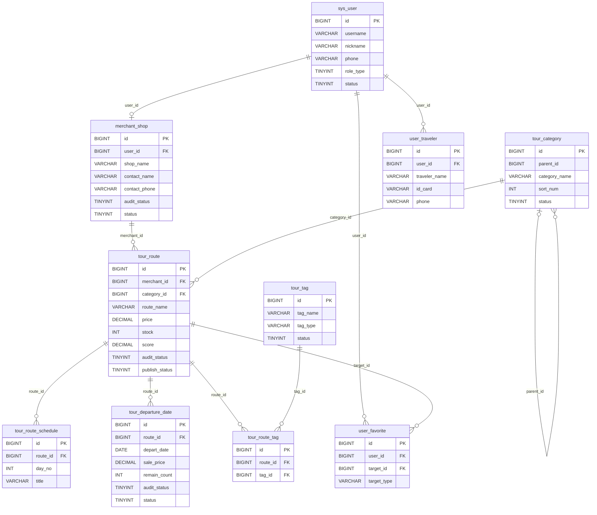
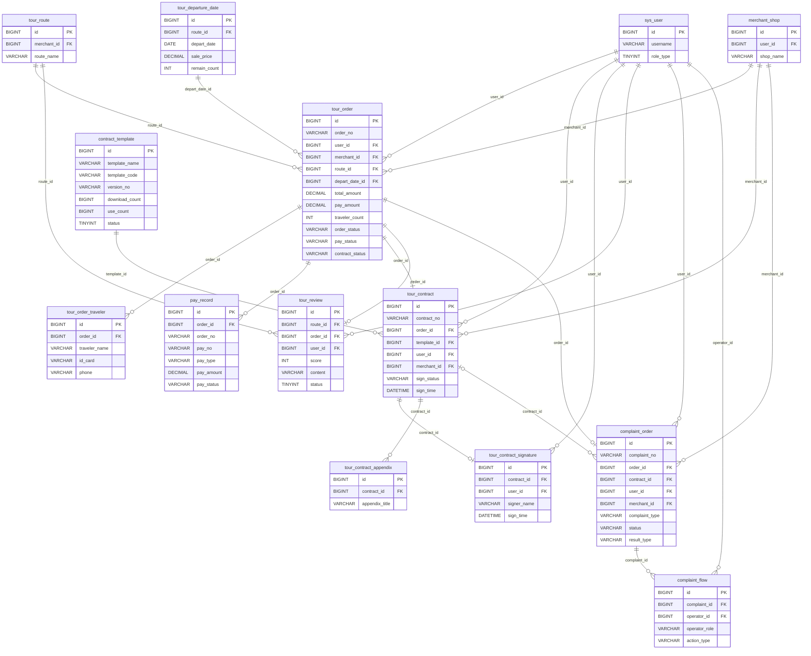
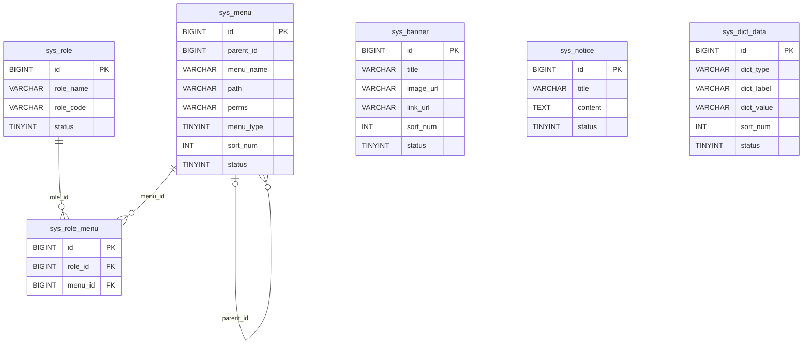

# Yutu Travel 项目 E-R 图

生成时间：2026-03-21  
数据来源：

- `yutu-admin/src/main/resources/sql/init.sql`
- `yutu-admin/src/main/resources/sql/upgrade_route_audit.sql`
- `yutu-admin/src/main/resources/sql/upgrade_merchant_apply.sql`
- `yutu-admin/src/main/resources/sql/upgrade_contract_template_stats.sql`
- `ContractSignatureSchemaRunner`
- `TourDepartureDateAuditSchemaRunner`
- 当前数据库 `yutu_travel`

说明：

- 这个项目的大部分关联是“逻辑外键”，数据库本身没有显式声明 `FOREIGN KEY`，下面的关系按表字段语义和后端代码推导。
- `tour_route.merchant_id`、`tour_order.merchant_id`、`tour_contract.merchant_id`、`complaint_order.merchant_id` 指向的是 `merchant_shop.id`，不是 `sys_user.id`。
- `user_favorite.target_id` 当前项目实际用于收藏路线，`target_type` 默认是 `ROUTE`。
- `tour_order_traveler` 是下单时的出行人快照表，和 `user_traveler` 没有物理外键。

## 1. 用户、商家、路线

## 2. 订单、支付、合同、评价、投诉

## 3. 权限、菜单、运营内容

补充说明：

- `sys_user.role_type` 在业务上对应 `USER / MERCHANT / ADMIN`，但库里不是通过 `role_id` 外键关联 `sys_role`。
- `sys_banner`、`sys_notice`、`sys_dict_data` 是独立运营配置表，没有直接外键关系。

## 4. 业务主链路

如果只看这个项目最核心的业务链路，可以概括为：

`sys_user` -> `merchant_shop` -> `tour_route` -> `tour_departure_date` -> `tour_order` -> `pay_record` / `tour_contract` -> `tour_review` / `complaint_order`

